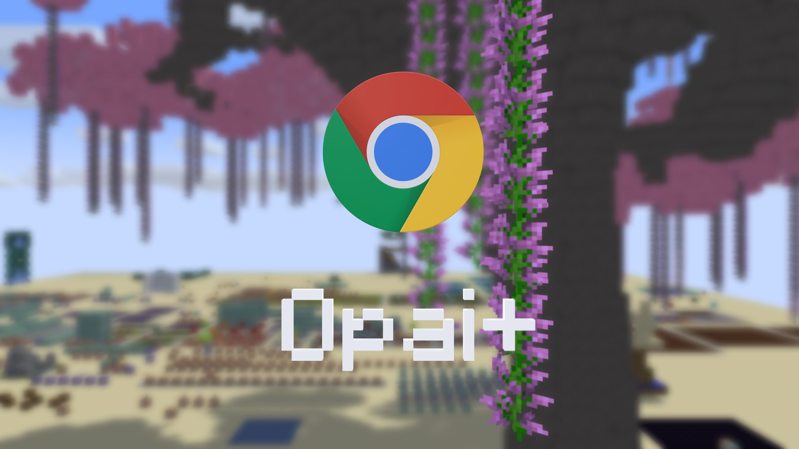

# OpaiPlus

   <!--suppress CheckImageSize -->
   

## More Features, More Fun.

## Installation

To install **OpaiPlus**, follow these steps:

1. Download the `.jar` file from [GitHub Releases](https://github.com/opai-client/OpaiPlus/releases).
2. Double-click the downloaded `.jar` file to launch the installer.
3. Click **"Install"** and follow the on-screen instructions.
4. Enjoy the enhanced experience!

**Tip:** You may need to run `.extension reload` to apply changes immediately.

## Compatibility

OpaiPlus automatically checks for compatibility upon startup.

If you encounter errors such as **"Failed to initialize."** or **"Compatibility test failed. Some features may not function correctly."**,  
please verify that you are using a compatible version before reporting an issue.

## Acknowledgments

Without these projects, `OpaiPlus` would not exist:

Special thanks to:
- [FastUtil](https://fastutil.di.unimi.it/) – A high-performance, compact type-specific collection library, licensed under Apache License 2.0.

Special thanks to all contributors in the open-source community!
